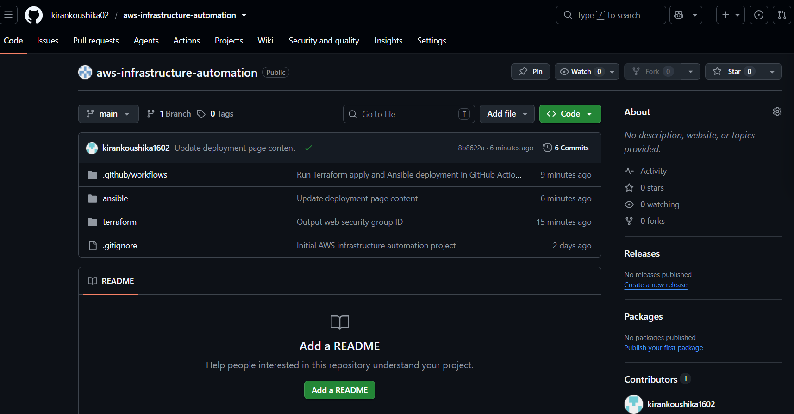
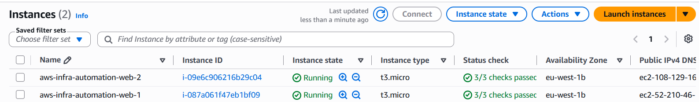
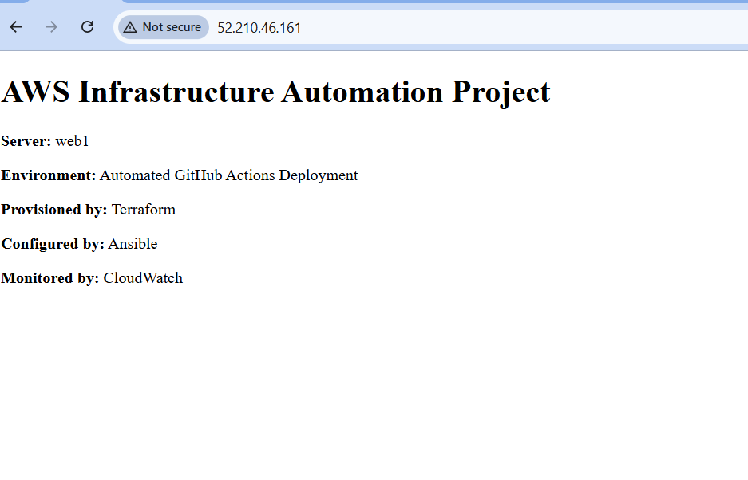
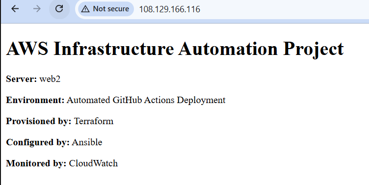
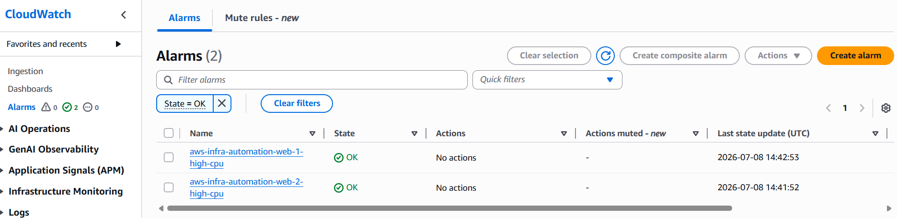
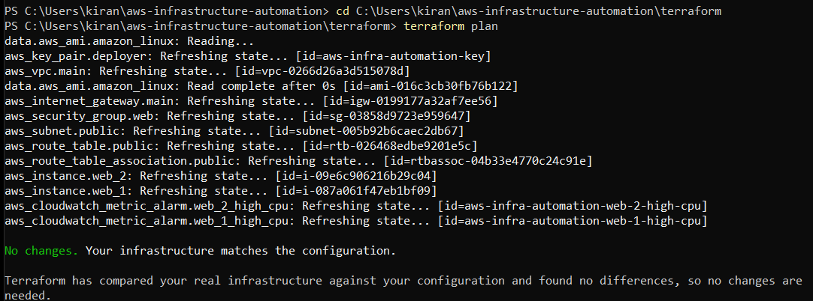

# AWS Infrastructure Provisioning & Automation

A DevOps infrastructure automation project that provisions AWS infrastructure with Terraform, configures EC2 web servers with Ansible, automates deployments through GitHub Actions, and monitors infrastructure health with Amazon CloudWatch.

## Project Overview

This project demonstrates an end-to-end Infrastructure as Code and configuration management workflow:

```text
GitHub Push
   -> GitHub Actions
   -> AWS OIDC Authentication
   -> Terraform Apply
   -> EC2 Public IP Outputs
   -> Temporary SSH Access for Runner
   -> Ansible Deployment
   -> Nginx Web Servers Updated
   -> Temporary SSH Rule Removed
```

## Tech Stack

- **Terraform** - AWS infrastructure provisioning
- **AWS EC2** - compute instances
- **AWS VPC** - custom networking
- **AWS S3** - remote Terraform state backend
- **AWS CloudWatch** - infrastructure monitoring and alarms
- **GitHub Actions** - CI/CD automation
- **Ansible** - server configuration management
- **Nginx** - web server deployed to EC2
- **OIDC** - secure GitHub Actions authentication to AWS

## Architecture

```text
Developer
   |
   | git push
   v
GitHub Repository
   |
   v
GitHub Actions Workflow
   |
   |-- Assumes AWS IAM Role using OIDC
   |-- Runs Terraform init/validate/apply
   |-- Reads Terraform outputs
   |-- Temporarily opens SSH from GitHub runner IP
   |-- Runs Ansible playbook
   |-- Removes temporary SSH access
   v
AWS Infrastructure
   |
   |-- Custom VPC
   |-- Public subnet
   |-- Internet Gateway
   |-- Route table
   |-- Security group
   |-- 2 EC2 instances
   |-- CloudWatch CPU alarms
   |-- S3 remote Terraform state
```

## Features Implemented

### 1. Terraform Infrastructure Provisioning

Terraform provisions the full AWS infrastructure:

- Custom VPC
- Public subnet
- Internet Gateway
- Public route table
- Route table association
- Security group for HTTP and SSH
- EC2 key pair
- Two Amazon Linux 2023 EC2 instances
- CloudWatch CPU utilization alarms
- S3 remote backend for Terraform state

### 2. Remote Terraform State

Terraform state is stored remotely in an S3 bucket rather than only on the local machine. This allows both the developer laptop and GitHub Actions runner to share the same infrastructure state.

Backend path:

```text
aws-infrastructure-automation/terraform.tfstate
```

### 3. Ansible Configuration Management

Ansible connects to both EC2 instances and applies the same configuration:

- Installs Nginx
- Starts Nginx
- Enables Nginx on boot
- Deploys a custom HTML page using a Jinja2 template

The template uses Ansible's `inventory_hostname` so each server renders its own identity:

```text
Server: web1
Server: web2
```

### 4. GitHub Actions CI/CD

The workflow automates infrastructure and deployment tasks:

- Checks out the repository
- Authenticates to AWS using OIDC
- Installs Terraform
- Runs `terraform init`
- Runs `terraform fmt -check`
- Runs `terraform validate`
- Runs `terraform apply`
- Captures EC2 public IPs and security group ID
- Temporarily allows SSH from the GitHub runner public IP
- Installs Ansible
- Generates the Ansible inventory dynamically
- Runs the Ansible playbook
- Removes temporary SSH access after deployment

### 5. CloudWatch Monitoring

CloudWatch metric alarms were configured for both EC2 instances:

- `aws-infra-automation-web-1-high-cpu`
- `aws-infra-automation-web-2-high-cpu`

Each alarm monitors EC2 `CPUUtilization` and enters alarm state if CPU reaches the configured threshold.

## Repository Structure

```text
aws-infrastructure-automation/
|
|-- .github/
|   `-- workflows/
|       `-- deploy.yml
|
|-- ansible/
|   |-- inventory.ini
|   |-- playbook.yml
|   |-- aws-infra-key.pub
|   `-- templates/
|       `-- index.html.j2
|
|-- screenshots/
|
|-- terraform/
|   |-- backend.tf
|   |-- providers.tf
|   |-- variables.tf
|   |-- network.tf
|   |-- security.tf
|   |-- ec2.tf
|   |-- monitoring.tf
|   `-- outputs.tf
|
|-- .gitignore
`-- README.md
```

## Screenshots

### GitHub Repository Structure



### GitHub Actions Successful Runs


### Code Change Triggering Automated Deployment


### EC2 Instances Running



### Web Server 1



### Web Server 2



### CloudWatch Alarms



### Terraform Remote State Backend Configuration


### Terraform Plan - No Changes



## How to Run Locally

### Prerequisites

- AWS CLI configured
- Terraform installed
- Git installed
- WSL/Ubuntu with Ansible installed
- Valid AWS IAM permissions

### Terraform Commands

Run Terraform from the `terraform` directory:

```powershell
cd terraform
terraform init
terraform fmt
terraform validate
terraform plan
terraform apply
```

### Ansible Commands

Run Ansible from the project root inside WSL/Ubuntu:

```bash
ansible all -i ansible/inventory.ini -m ping
ansible-playbook -i ansible/inventory.ini ansible/playbook.yml
```

## Security Notes

- The private SSH key is excluded from Git using `.gitignore`.
- Terraform state files are excluded from Git.
- GitHub Actions uses OIDC instead of storing AWS access keys in GitHub.
- SSH access from GitHub Actions is temporary and restricted to the runner public IP.
- The temporary SSH ingress rule is removed after deployment.

## Resume Bullets

- Provisioned 2 AWS EC2 instances using Terraform, managing remote state, VPC configuration, routing, and security groups to automate environment builds and eliminate manual provisioning.
- Automated CI/CD deployments using GitHub Actions, integrating Terraform and Ansible to ensure consistent Nginx configuration across both EC2 instances.
- Configured CloudWatch CPU utilization alarms across 2 EC2 instances to provide continuous infrastructure visibility and threshold-based monitoring.

## Cleanup

To avoid AWS charges, destroy the infrastructure when the project demonstration is complete:

```powershell
cd terraform
terraform destroy
```

Type `yes` when prompted.
